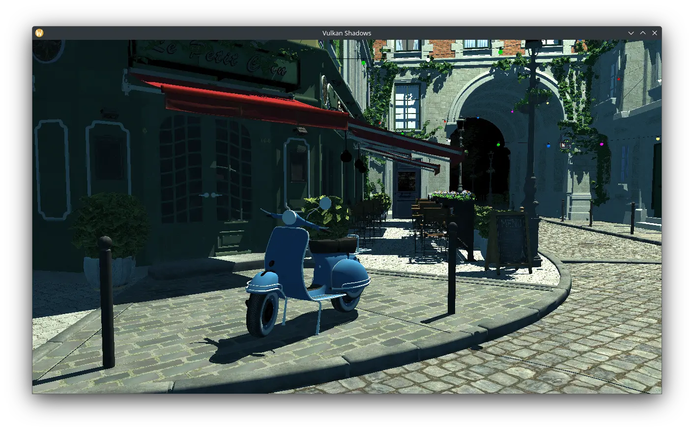

Vulkan Shadows
---

This is an application demonstrating several shadow-rendering techniques using Vulkan:
- Per-triangle shadow volumes
- Silhouette-based shadow volumes
- Cube shadow mapping



(Screenshot of the [Amazon Lumberyard Bistro](https://developer.nvidia.com/orca/amazon-lumberyard-bistro) scene in the result program.)

## Building

Compiled Windows executable, along with sample scenes, can be found in the [Releases](https://github.com/Fothsid/VulkanShadows/releases) section.

### Linux

1. Have the following available in your environment:  
- `cmake` (>=3.11)
- `g++` (GCC >=13)
- `glslc` from [shaderc](https://github.com/google/shaderc)
- Vulkan headers (>=1.2), loader, and utility libraries.
- SDL2

On Arch Linux, these dependencies can be installed using the following command:
```
sudo pacman -S gcc cmake shaderc sdl2-compat vulkan-headers vulkan-icd-loader
```
On Ubuntu, this command can be used instead:
```
sudo apt install g++ libvulkan-dev vulkan-utility-libraries-dev glslc cmake git libsdl2-dev
```

2. Clone the repository and download the submodules:  
```
git clone --recurse-submodules https://github.com/Fothsid/VulkanShadows.git
cd VulkanShadows
```

3. Generate build files using CMake:
```
cmake -DCMAKE_BUILD_TYPE=Release -B build .
```

4. Build:
```
cmake --build build --config Release
```

### Windows

1. Download and install:  
- [Visual Studio 2022 with MSVC >=16.10](https://visualstudio.microsoft.com/)
- [Vulkan SDK (at least 1.2)](https://vulkan.lunarg.com/sdk/home)
- [SDL2-devel (can be installed by the Vulkan SDK too)](https://github.com/libsdl-org/SDL/releases/tag/release-2.32.4)
- [CMake](https://cmake.org/download/)

2. Clone the repository and download the submodules:  
```
git clone --recurse-submodules https://github.com/Fothsid/VulkanShadows.git
cd VulkanShadows
```

> WARNING: Source code downloaded via GitHub's "Download ZIP" button will not work as it does not include submodules.

3. Generate build files for Visual Studio using CMake:
```
cmake -DCMAKE_BUILD_TYPE=Release -B build .
```
This can also be done via the CMake GUI. If CMake can't find the SDL2 library, set the variable `SDL2_DIR` to a path to the `cmake` folder inside your distribution of SDL2. (If Vulkan SDK was installed to the default path with SDL2, the path would be `C:\VulkanSDK\<version>\cmake`)

4. Open the generated `.sln` file in Visual Studio and build it from there.

> NOTE: On Windows built executables are contained in an additional folder depending on the build type (Release or Debug). You might have to copy the `shaders` folder with compiled `.spirv` shaders to the folder with the executable.

## How to run

Pass in a .gltf/.glb file as an argument to the program. In Windows this can be done by drag-and-dropping the file onto the executable.

You can also use the `--help` parameter to list all available options.

Controls:
- `F12` -- Hide/unhide the GUI
- Clicking outside the GUI window will enter flycam mode.
- In flycam mode:
    - Mouse -- Rotate the camera.
    - `W`/`A`/`S`/`D` -- Move the camera.
    - `Left Shift` -- Hold to increase movement speed.
    - `Esc` -- Leave flycam mode.

## Used libraries/dependencies

- [Vulkan SDK](https://vulkan.lunarg.com/)
- [Vulkan Memory Allocator](https://gpuopen.com/vulkan-memory-allocator/)
- [glslc](https://github.com/google/shaderc)
- [SDL2](https://www.libsdl.org/)
- [GLM](https://github.com/g-truc/glm)
- [TinyGLTF](https://github.com/syoyo/tinygltf)
- [Dear ImGui](https://github.com/ocornut/imgui)
- [ImGuizmo](https://github.com/CedricGuillemet/ImGuizmo)
- [stb_image](https://github.com/nothings/stb)
- [dds_image](https://github.com/spnda/dds_image)
